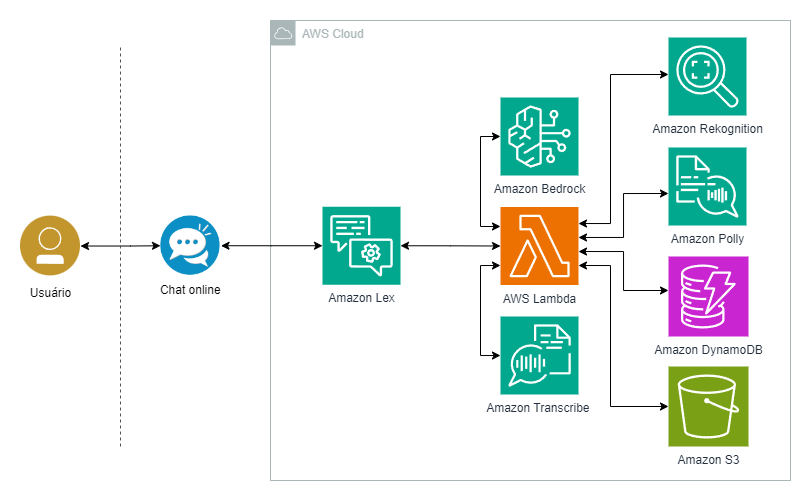

# Avaliação Sprints 9 e 10 - Projeto Final - Programa de Bolsas Compass UOL / AWS - turma maio/2024

Avaliação final do programa de bolsas Compass UOL para formação em machine learning para AWS.

---

# IFPBot - Academic Process Bot

## 1. Definição do tema do trabalho

### Descrição do Projeto
O projeto consiste em um bot de assistência para processos acadêmicos, desenvolvido para alunos do IFPB. O bot tem como objetivo simplificar e otimizar o gerenciamento de processos acadêmicos, proporcionando orientação sobre procedimentos, envio de documentos, análise de imagens, e acompanhamento de status dos processos, utilizando tecnologias avançadas de inteligência artificial.

### Justificativa
A importância deste projeto reside na simplificação e automação dos processos acadêmicos, melhorando a eficiência e a experiência do usuário. O bot visa reduzir a carga administrativa tanto para os alunos quanto para o corpo administrativo, fornecendo suporte contínuo durante o andamento dos processos acadêmicos. Com a utilização de tecnologias como reconhecimento de imagem e IA generativa, o bot pode oferecer respostas mais personalizadas e seguras, garantindo que todas as etapas sejam executadas corretamente.

### Escopo
O projeto abordará as seguintes funcionalidades principais:
- **Orientação sobre processos acadêmicos:** Guiar os alunos sobre os requisitos e procedimentos de diferentes processos.
- **Envio e verificação de documentos:** Permitir que os alunos enviem documentos necessários e verifiquem sua conformidade automaticamente.
- **Acompanhamento do status dos processos:** Fornecer atualizações em tempo real sobre o status dos processos acadêmicos.
- **Geração de respostas avançadas e personalizadas:** Utilizar IA para fornecer respostas mais ricas e contextualizadas às consultas dos alunos.

## 2. Esboço da Arquitetura

### Visão Geral
O sistema será composto pelos seguintes componentes principais:
- **Amazon Lex:** Para gerenciamento das interações e compreensão de texto.
- **Amazon Polly:** Para conversão de texto em fala, facilitando o acesso para alunos com deficiência visual ou preferências auditivas.
- **Amazon S3:** Para armazenamento seguro de documentos enviados pelos alunos.
- **AWS Lambda:** Para gerenciamento da lógica do bot, integrando diferentes serviços e processos.
- **Amazon Rekognition:** Para análise de imagens, reconhecimento facial e verificação de documentos enviados.
- **Amazon Bedrock:** Para fornecer respostas avançadas e personalizadas utilizando IA generativa.
- **Amazon Transcribe:** Para transcrição de mensagens de voz enviadas pelos usuários, ampliando a acessibilidade.
- **Amazon DynamoDB:** Para armazenamento de dados estruturados relacionados a processos acadêmicos e interações do bot.

### Detalhamento dos Componentes
- **Frontend:** Interface onde os alunos interagem com o bot, podendo ser web ou mobile. Esta interface deve ser responsiva e intuitiva, facilitando a navegação e o uso.
- **Backend:** AWS Lambda gerencia a lógica do bot, coordenando chamadas aos serviços como Amazon Lex, Rekognition, e Bedrock, processando dados e executando funções conforme necessário.
- **Armazenamento:** Amazon S3 garante o armazenamento seguro dos documentos, com políticas de acesso configuradas para proteger dados sensíveis.
- **Processamento de Linguagem Natural:** Amazon Lex para processamento de linguagem natural, ajudando o bot a entender e responder a consultas textuais. Amazon Bedrock complementa essa capacidade, oferecendo respostas avançadas baseadas em contexto e aprendizado de máquina.
- **Reconhecimento de Imagens e Análise de Documentos:** Amazon Rekognition é utilizado para análise de imagens enviadas, como fotos de documentos, para verificação de identidade e extração de informações.
- **Transcrição de Voz:** Amazon Transcribe converte mensagens de voz enviadas pelos usuários em texto, ampliando as formas de interação.
- **Notificações:** Serviços de notificação para envio de e-mails ou mensagens sobre o status dos processos, assegurando que os alunos sejam informados de qualquer atualização relevante.
###

  

###
***

O diagrama mostra como o usuário interage com a interface de chat, que envia solicitações para o Amazon Lex. O Amazon Lex processa essas solicitações, chama funções Lambda para manipulação de dados, verifica identidades usando o Amazon Rekognition, armazena documentos no Amazon S3, e utiliza o Amazon Bedrock para fornecer respostas avançadas. Finalmente, o Amazon Polly pode ser utilizado para converter texto em fala, criando uma resposta mais interativa para o usuário.

## Execução

Deverá ser produzido um projeto final para apresentação pública até o último dia deste Programa de Bolsas.

**Especificações**:

A equipe devevá:

1 - Escolher uma aplicação prática para implementação e definir a arquitetura preliminar AWS até 02/09/2024;

2 - A aplicação deverá contemplar, no mínimo, as seguintes ferramentas AWS:

- Transcribe e/ou Polly;
- Rekognition;
- Bedrock;
- Lex;
  
3 - O canal do chatbot Lex deverá ser de uso público e permitir o envio de som e imagem.

Dicas: procurem implementar uma aplicação de apelo social e, neste sentido, busquem contatos com organizações públicas (universidades, associações, etc.).

***

## O que será avaliado

- Praticidade de utilização;
- Eficácia da aplicação;
- Uso racional da arquitetura AWS;
- Projeto em produção na AWS;
- Códigos utilizados na implementação da arquitetura;
- Prompt utilizado no Bedrock;
- Se usado o modelo para treinamento/reconhecimento:
  - Divisão dos dados para treino e teste, se utilizado treinamento;
  - Taxa de assertividade aceitável (se o modelo está classificando corretamente);
  - Entendimento da equipe sobre o modelo utilizado (saber explicar o que foi feito);
  - Mostrar resposta do modelo para classificação;
- Organização geral do código fonte:
  - Estrutura de pastas;
  - Divisão de responsabilidades em arquivos/pastas distintos;
  - Otimização do código fonte (evitar duplicações de código);
- Objetividade do README.md.

***

## Entrega

- **O trabalho deve ser feito em grupos entre cinco e seis pessoas cada, que serão distribuídos em reunião dia 26/08/2024**;
- Criar uma branch no repositório com o formato grupo-número (Exemplo: grupo-1);
- **O tema do trabalho e o esboço da arquitetura deverão estar publicados no github até dia 02/09/2024**;
- **O grupo deverá fazer uma apresentação de protótipo (prova de conceito - PoC) em ensaio preliminar entre os dias 23/09/2024 e 02/10/2024**;
- Subir o trabalho na branch com um README.md:
  - documentar detalhes sobre como a avaliação foi desenvolvida;
  - dificuldades conhecidas;
  - como utilizar o sistema;
  - 🔨 código fonte desenvolvido (observar estruturas de pastas);
- **Cada grupo deverá fazer uma apresentação do trabalho completo desenvolvido no dia 07/10/2024**;
- **O prazo de entrega é até às 09h do dia 09/10/2024 no repositório do github** (https://github.com/Compass-pb-aws-2024-MAIO-A/sprints-9-10-pb-aws-maio).
