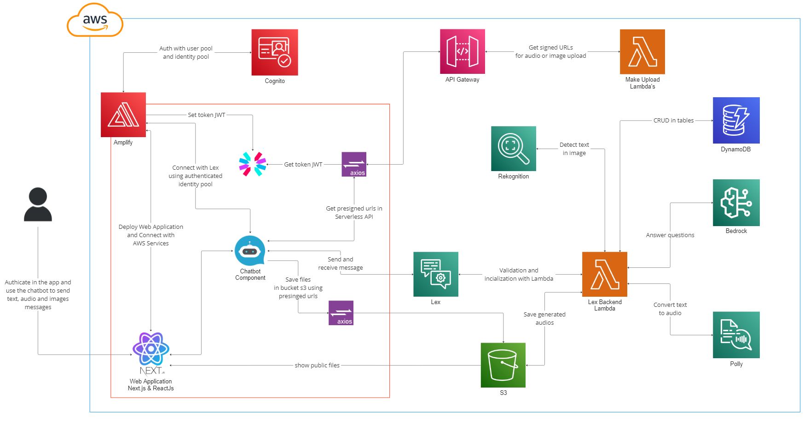

# 🎓🤖 ACBot

O projeto **ACBot** foi desenvolvido como parte das sprints 9 e 10 do programa de bolsas Compass UOL para formação em machine learning na AWS e tem como objetivo criar um chatbot educacional utilizando o **Amazon Lex** e outras tecnologias da AWS para fornecer informações sobre processos academicos do Instituto Federal de Educação, Ciência e Tecnologia da Paraíba.

## 📖 Índice

- [🔎 Sobre o Chatbot](#-sobre-o-chatbot)
  - [Descrição do projeto](#descrição-do-projeto)
  - [Justificativa](#justificativa)
  - [Principais funcionalidades](#️-principais-funcionalidades)
- [🏛️ Arquitetura](#️-arquitetura)
- [⚙️ Tecnologias Utilizadas](#️-tecnologias-utilizadas)
- [🚀 Execução e Utilização](#-execução-e-utilização)
  - [Pré-requisitos](#pré-requisitos)
  - [Passos de inicialização](#passos-de-inicialização)
  - [Passos para executar as funções com o Serverless no API Gateway e Lambda](#passos-para-executar-as-funções-com-o-serverless-no-api-gateway-e-lambda)
  - [Passos para executar o chatbot no Lex e o backend no Lambda](#passos-para-executar-o-chatbot-no-lex-e-o-backend-no-lambda)
- [🧱 Estrutura do Projeto](#-estrutura-do-projeto)
- [🚧 Desafios e Soluções](#-desafios-e-soluções)
- [🌐 Acesso ao Chatbot](#-acesso-ao-chatbot)
- [👥 Contribuidores](#-contribuidores)


## 🔎 Sobre o Chatbot

### Descrição do projeto
O projeto consiste em um bot de assistência para processos acadêmicos, desenvolvido para alunos do IFPB, com o objetivo de simplificar e otimizar o gerenciamento de processos acadêmicos. Ele proporciona orientação sobre procedimentos e análise de documentos, utilizando tecnologias avançadas de inteligência artificial para oferecer um suporte eficiente e prático nas seguintes áreas:

### Justificativa
A importância deste projeto reside na simplificação dos processos acadêmicos, melhorando a eficiência e a experiência do usuário. O bot visa reduzir a carga administrativa tanto para os alunos quanto para o corpo administrativo. Com a utilização de tecnologias como reconhecimento de imagem e IA generativa, o bot pode oferecer respostas mais personalizadas e seguras, garantindo que todas as etapas sejam executadas corretamente.

### Principais Funcionalidades
- **Consulta de processos acadêmicos:** Integração com DynamoDB para armazenar e consultar tipos de processos acadêmicos.
- **Reconhecimento de imagens:** Utiliza o Amazon Rekognition para validação de documentos.
- **Conversão de texto para áudio:** Com o Amazon Polly, o bot gera áudio a partir de respostas textuais.

## 🏛️ Arquitetura

### Visão Geral

O sistema é composto pelos seguintes componentes principais:

- **React:** Frontend do sistema, onde os alunos interagem com o bot por meio de uma interface web moderna, responsiva e intuitiva.
- **Axios:** Utilizado para fazer chamadas HTTP no frontend, facilitando a comunicação com as APIs do backend.
- **AWS Amplify:** Facilita a integração do frontend com os serviços AWS, simplificando a autenticação, o armazenamento e a interação com as APIs do sistema.
- **Amazon Cognito:** Gerencia a autenticação e autorização dos usuários (alunos), garantindo que somente usuários autenticados tenham acesso a determinadas funcionalidades.
- **Amazon Lex:** Gerencia as interações e a compreensão de texto, oferecendo um chatbot inteligente.
- **Amazon Polly:** Converte texto em fala, facilitando o acesso para alunos com deficiência visual ou preferências auditivas.
- **Amazon S3:** Armazena com segurança documentos enviados pelos alunos, como documentos pessoais.
- **AWS Lambda:** Gerencia a lógica do bot, integrando diferentes serviços e processos.
- **Amazon Rekognition:** Analisa e verifica os documentos enviados.
- **Amazon Bedrock:** Fornece respostas avançadas e personalizadas utilizando IA generativa.
- **Amazon DynamoDB:** Armazena dados estruturados relacionados aos processos acadêmicos e interações do bot.

### Detalhamento dos Componentes

- **Frontend (React + Amplify):** A interface de usuário (UI) foi construída usando **React**, que oferece uma experiência interativa e moderna. **AWS Amplify** foi utilizado para facilitar a integração do frontend com os serviços da AWS, especialmente na autenticação (Cognito) e chamadas de API (Axios).
  
  - **Axios** foi usado para realizar requisições HTTP entre o frontend e o backend (AWS Lambda), manipulando respostas e erros de forma eficiente.
  
- **Autenticação e autorização (Cognito):** **Amazon Cognito** gerencia o controle de usuários e permissões. Ele autentica os usuários e gera tokens de autorização para garantir o acesso seguro às APIs e dados.

- **Backend (AWS Lambda):** **Lambda** gerencia toda a lógica do bot, integrando-se com serviços como Amazon Lex, Rekognition, Bedrock e Polly. Ele também coordena as chamadas de outros serviços AWS, como o armazenamento de dados no DynamoDB e o armazenamento de documentos no S3.

- **Armazenamento (S3):** **Amazon S3** é utilizado para armazenar documentos enviados pelos alunos.

- **Processamento de linguagem natural (Lex + Bedrock):** O **Amazon Lex** gerencia a compreensão e processamento de linguagem natural, permitindo que o bot responda a perguntas textuais. O **Amazon Bedrock** complementa o Lex, utilizando IA generativa para fornecer respostas mais avançadas e personalizadas.

- **Reconhecimento de imagens (Rekognition):** O **Amazon Rekognition** é utilizado para análise de imagens, como fotos de documentos, verificando legibilidade e autenticidade.

- **Armazenamento de dados (DynamoDB):** **Amazon DynamoDB** armazena dados estruturados sobre os processos acadêmicos e interações dos alunos com o sistema.

### Fluxo de Interação

1. O aluno acessa o frontend do sistema, construído com **React**, e faz login utilizando o **Amazon Cognito**.
2. Após autenticado, o aluno interage com o bot, enviando perguntas, documentos ou mensagens de voz. O **Amazon Lex** processa as interações textuais e de voz e, se necessário, chama o **AWS Lambda** para processar a lógica exigida.
3. Se o aluno enviar um documento, o **Amazon Rekognition** é chamado para verificar a autenticidade e a legibilidade do arquivo.
4. O bot pode utilizar o **Amazon Polly** para converter respostas textuais em áudio, facilitando a interação para alunos com necessidades especiais.
5. Os dados e documentos dos alunos são armazenados de forma segura no **Amazon S3** e **Amazon DynamoDB**.
6. O frontend se comunica com o backend utilizando **Axios**, enviando dados e recebendo respostas.
7. **AWS Amplify** facilita a conexão entre o frontend e os serviços AWS, como o Cognito e as APIs de backend.

### Diagrama de arquitetura

<p align="center">
  
</p>

## ⚙️ Tecnologias Utilizadas

1. **[Lex](https://aws.amazon.com/lex/)** - *Interface de conversa do bot, que permite interações naturais com os usuários.*
2. **[Polly](https://aws.amazon.com/polly/)** - *Conversão de texto para fala, proporcionando uma experiência de voz ao usuário.*
3. **[Lambda](https://aws.amazon.com/lambda)** - *Backend do chatbot e integração dos serviços, permitindo execução de código em resposta a eventos.*
4. **[DynamoDB](https://aws.amazon.com/dynamodb/)** - *Banco de dados NoSQL para armazenar dados do chatbot, garantindo alta escalabilidade e desempenho.*
5. **[API Gateway](https://aws.amazon.com/api-gateway)** - *Exposição de funções Lambda via endpoints API, facilitando a comunicação entre o frontend e o backend.*
6. **[Cognito](https://aws.amazon.com/cognito/)** - *Serviço de autenticação e controle de acesso, assegurando que apenas usuários autorizados possam interagir com o bot.*
7. **[Serverless Framework](https://www.serverless.com/)** - *Facilita a construção e implementação de aplicações serverless, simplificando a gestão de recursos na nuvem.*
8. **[Nextjs](https://nextjs.org)** - *Biblioteca JavaScript para construir frontends/backends baseados em ReactJs.*
8. **[React](https://reactjs.org)** - *Biblioteca JavaScript para construir interfaces de usuário, proporcionando uma experiência interativa e responsiva.*
9. **[Axios](https://axios-http.com/)** - *Biblioteca para realizar requisições HTTP, facilitando a comunicação com APIs externas.*
10. **[S3](https://aws.amazon.com/s3)** - *Armazenamento de arquivos de áudio e logs, oferecendo uma solução escalável para armazenar dados.*
11. **[Rekognition](https://aws.amazon.com/rekognition/)** - *Serviço de análise de imagem e vídeo, que pode ser utilizado para melhorar a interação do bot.*
12. **[Bedrock](https://aws.amazon.com/bedrock/)** - *Plataforma de modelos generativos de IA, proporcionando recursos avançados de inteligência artificial.*
13. **[Amplify](https://aws.amazon.com/amplify/)** - *Plataforma para desenvolvimento e hospedagem de aplicativos web e mobile, facilitando o gerenciamento de recursos AWS.*
14. **[Git](https://git-scm.com)** - *Controle de versão do projeto, garantindo rastreamento e gerenciamento de alterações.*
15. **[Trello](https://trello.com)** - *Gerenciamento das tarefas do projeto, organizando o fluxo de trabalho da equipe.*
16. **[AWS CLI](https://aws.amazon.com/cli/)** - *Interface de linha de comando para gerenciar serviços AWS, facilitando a automação de tarefas.*

## 🤖 Intents do Chatbot

### 1. **WelcomeIntent**
   - **Descrição:** Saudação inicial e orientações ao usuário sobre como o bot pode ajudar.
   - **Exemplos de frases:**
     - "Olá"
     - "Oi"
     - "Quais informações posso obter?"

### 2. **ProcessOpeningGuideIntent**
   - **Descrição:** Fornece orientação sobre como abrir um processo.
   - **Exemplos de frases:**
     - "Como posso abrir um processo acadêmico?"
     - "Quais são os passos para iniciar um processo de revisão de nota?"

### 3. **ListAllProcessTypesIntent**
   - **Descrição:** Lista todos os tipos de processos acadêmicos disponíveis no IFPB, fornecendo uma visão geral de cada um.
   - **Exemplos de frases:**
     - "Quais são os tipos de processos acadêmicos disponíveis?"
     - "Quais são os processos acadêmicos que a instituição oferece?"

### 4. **CheckProcessTypesIntent**
   - **Descrição:** Consulta um processo acadêmico específico.
   - **Exemplos de frases:**
     - "Quero consultar um processo acadêmico."
     - "Quero informações detalhadas sobre um processo acadêmico."

### 5. **ProcessOutcomeIntent**
   - **Descrição:** Efetua consultas sobre os efeitos resultantes dos requerimentos de processos abertos anteriormente e responde perguntas especificas sobre as informações fornecidas.
   - **Exemplos de frases:**
     - "Como saber a situação do meu processo?"
     - "Como verificar se meu requerimento foi aceito?"

### 6. **CheckDocumentLegibilityIntent**
   - **Descrição:** Verifica a legibilidade de documentos que são usados para abertura de processos.
   - **Exemplos de frases:**
     - "Eu gostaria de verificar a legibilidade de um documento."
     - "Você pode me ajudar a verificar se meu documento está legível?"

### 7. **FallbackIntent**
   - **Descrição:** Acionada quando o bot não compreende a solicitação do usuário.

## 🚀 Execução e utilização

### Pré-requisitos

### Passos de inicialização

### Passos para executar as funções com o Serverless no API Gateway e Lambda

### Passos para executar o chatbot no Lex e o backend no Lambda


## 🧱 Estrutura do projeto


```
├── api
│   ├── controllers
│   ├── lib
│   │   ├── .env.example
│   │   ├── index.js
│   ├── serverless.yml
├── assets
├── bot
├── server
│   ├── database
│   ├── lambda
│   │   ├── controllers
│   │   ├── lib
│   │   ├── utils
│   │   ├── index.js
│   ├── node_modules
│   ├── .env.example
│   ├── package-lock.json
│   ├── package.json
│   ├── server.js
├── web
├── .gitignore
└── README.md
```

### Descrição das principais pastas

- **`api/`**: Controladores das rotas e configuração do Serverless para o deploy de funções Lambda.
- **`assets/`**: Armazena recursos estáticos.
- **`server/`**: Contém a lógica do backend, incluindo funções Lambda e scripts de manipulação de banco de dados.
- **`database/`**: Contém dados em JSON e scripts de migração/seeder para o DynamoDB.
- **`lambda/`**: Funções Lambda que processam as requisições do bot e realizam a integração com os serviços da AWS.
- **`utils/`**: Funções utilitárias que suportam o projeto, como a geração de áudio e consulta de dados.
- **`web/`**: Diretório reservado para a aplicação web (frontend e backend).
- **`.env.example`**: Exemplo de configuração de variáveis de ambiente.
- **`.gitignore`**: Arquivo que especifica quais arquivos ou pastas devem ser ignorados pelo Git.
- **`README.md`**: Arquivo de documentação principal do projeto.


## 🚧 Desafios e Soluções

### 1. Primeiro Contato com a SDK do JS
- **Desafio:** A equipe optou por usar java script no projeto, mas alguns membros não estavam familiarizados com a nova SDK uma vez que ao longo das sprint praticamente usamos apenas python
- **Solução:** Revisão na documentação da SDK disponibilizada pela AWS 

### 2. Utilização dos Recursos do Lex
- **Desafio:** Após as primeiras implementações das intents percebemos que podíamos melhorar 
- **Solução:** Revisão do código das intents delegando quando necessário, responsabilidades ao próprio lex ao invés de fazer tudo via código 

## 🌐 Acesso ao Chatbot

O ACBot está disponível em: [https://main.ded9i8rzd9kck.amplifyapp.com](https://main.ded9i8rzd9kck.amplifyapp.com)

## 👥 Contribuidores

| [<br><sub>Geraldo Mendes</sub>](https://github.com/Geraldomendes) | [<br><sub>João Emmanuel</sub>](https://github.com/KBSSA1) | [<br><sub>Richard Freitas</sub>](https://github.com/wesleyfreit) | [<br><sub>Ytallo Pereira</sub>](https://github.com/YtalloPereira) 
| :---: | :---: | :---: | :---: |

***